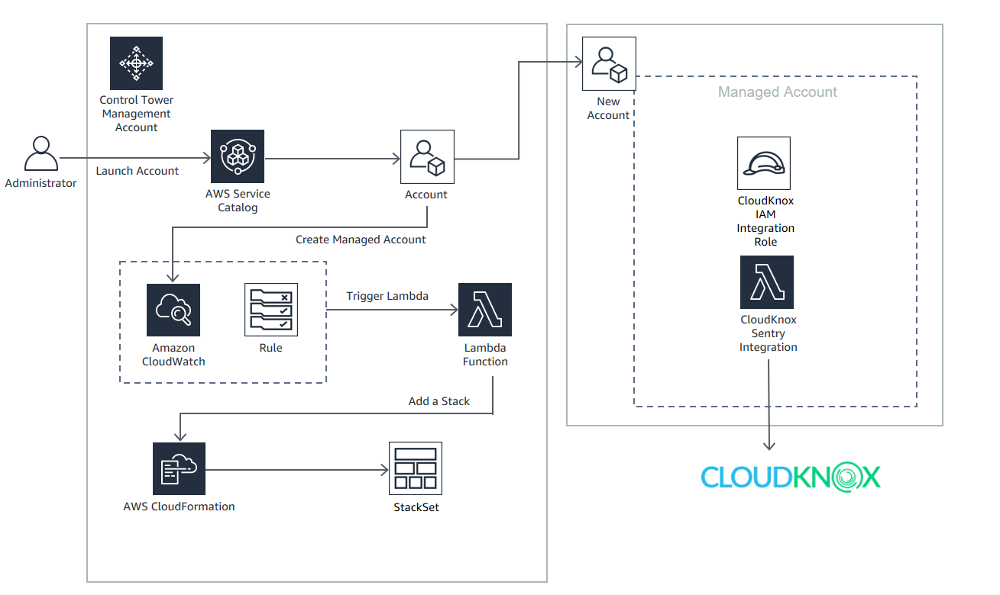

# Use AWS Control Tower with CloudKnox for automating Multi account Least Privileges in AWS

* AWS Control Tower Lifecyle Integration with Datadog - Allow new or updated AWS accounts in an AWS Control Tower based AWS Organization to be managed automatically by Datadog

## How it Works

1. **Template: aws-cloudknox-controltower.yml**:
 * This template provisions infrastructure in the Control Tower Management account that allows creation of CloudKnox integration role and the set up of CloudKnox Sentry in Control Tower managed accounts whenever a new Control Tower managed account is added
 * Creates a CloudKnox Stackset in the Control Tower Management Account 
 * Provisions a CloudWatchEvents Rule that is triggered based on a Control Tower Lifecycle Event
 * Provisions a Lifecyle Lambda as a target for the CloudWatch Events Rule
 	- The Lifecycle Lambda deploys a CloudKnox stack in the newly added Control Tower managed account--thus placing that account under CloudKnox management
  * Lifecycle Lambda performs a POST on the CloudKnox Add Account API  - https://app.cloudknox.io/api/v2/organization/auth-systems/aws/add that registers the new AWS managed account with the CloudKnox Sentry appliance monitoring the AWS Organization
 * The infrastructure provisioned by this template above allows for a Control Tower lifecycle event trigger specifically the CreateManagedAccount or UpdateManagedAccount events to:
	- Trigger the Lifecyle Lambda that creates CloudKnox stack instance in the managed account based on the CloudKnox stackset in the management account
 * All parameters that are needed for the CloudKnox integration such as API Key and Secret are stored and retrieved from AWS Secrets Manager

 

## Solution Design

## How to Install

**Prerequisites**

1.	Follow the step by step instructions in the CloudKnox documentation to set up and enable CloudKnox to securely collect AWS CloudTrail logs from your AWS account - https://docs.cloudknox.io/

2.	Log in to the CloudKnox API Integrations console - https://api.cloudknox.io/integrations and click on Generate New Key. Make a note of the generated Access Key, Secret Key and Service Account ID.

3.	Launch the **aws-cloudknox-prereq.yml** and enter the Access Key, Secret Key and the Service Account ID generated in the previous step. Accept all other default values for this template.

4.	The **aws-cloudknox-prereq.yml** template creates an Amazon S3 bucket with the following name: s3-cloudknoxiamuserrightsize-<AccountId>-<Region>. The <AccountId> and <Region> default to the AWS Account ID and AWS Region where you have deployed this template.
	1. Create a folder called ‘CloudKnox_TriggerLifecycleEvent’ in this S3 bucket. 
	2. Upload the CloudKnox_TriggerLifecycleEvent.zip in this folder

**Setup** 

The solution automates the initial setup and deployment in 1 step:

1.	Set up the AWS Control Tower Account Provisioning Automation for CloudKnox.
	1. Launch the **aws-cloudknox-controltower.yml** template.
	2. Substitute the <AccountId> and <Region> with the AWS Account ID and AWS Region where you have deployed this template

**Test** 

Test by creating a Lifecycle Event and add a managed account:

1. From the AWS Control Tower Management Account:
    - Use Account Factory or quick provision or Service Catalog to create a  new managed account in the AWS Control Tower Organization OR
    - Use Service Catalog (AccountFactory Product) to update an existing managed account - for e.g. change the OU of an existing managed account
 	- This can take up to 30 mins for the account to be sucessfully created and the AWS Control Tower Lifecycle Event to trigger
 	- Login to the AWS Control Tower managed account - 
 		- Validate that an AWS CloudFormation stack instance has been provisioned that launches the CloudKnox Integration role template in the managed account. 
 		- Follow the step by step instructions in the CloudKnox documentation - https://docs.cloudknox.io/ to check that data collection has started for the newly added account. In approximately 15 mins this account will show up in the CloudKnox dashboard with aPrivileged Creep Index (PCI) score calculated for this account.
 	

## Author 

Kanishk Mahajan
